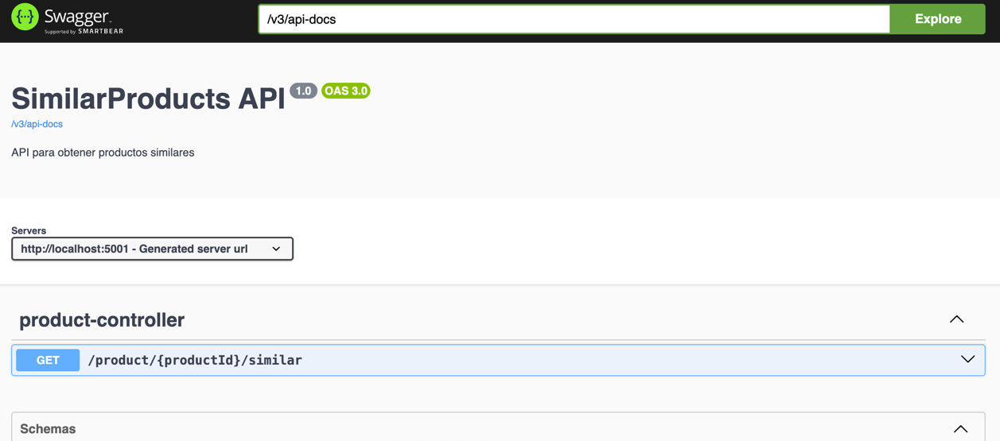

# SimilarProducts API

REST API to retrieve similar products for a given product. This project is part of a backend technical test to evaluate code clarity, maintainability, performance, and resilience.

**Version:** 1.0  
**Default Port:** 5001 (configurable)



---

## Table of Contents

- [Project Description](#project-description)
- [API Endpoints](#api-endpoints)
- [Swagger / OpenAPI Documentation](#swagger--openapi-documentation)
- [Running the Project with Docker](#running-the-project-with-docker)
- [Running Performance Tests](#running-performance-tests)
- [Technology Stack](#technology-stack)
- [Notes](#notes)

---

## Project Description

This project provides a new feature to display products similar to the one a customer is currently viewing. The REST API returns the details of similar products for a given product ID.

The existing simulated endpoints are:

1. **Get similar product IDs:**  
   `http://localhost:3001/product/{id}/similarids`

2. **Get product details by ID:**  
   Provided by the `simulado` infrastructure.

Your task is to implement the Spring Boot API that consumes these services and exposes the aggregated data to the frontend.

---


> Test and mock components are already included; only the API implementation is required.

---

## API Endpoints

### `GET /product/{productId}/similar`

Retrieve similar products for a given product.

**Parameters:**

| Name        | In   | Type   | Required | Description                                  |
|------------|------|--------|----------|----------------------------------------------|
| `productId` | path | string | Yes      | ID of the product to fetch similar products |

**Response 200 OK:**

```json
[
  {
    "id": "123",
    "name": "Product A",
    "price": 25.99,
    "availability": true
  },
  {
    "id": "124",
    "name": "Product B",
    "price": 19.5,
    "availability": false
  }
]

```
---
## Swagger / OpenAPI Documentation

You can explore the API interactively using Swagger UI:

### http://localhost:5001/webjars/swagger-ui/index.html

---

## Running the Project with Docker

Start the required containers:

### `docker-compose up -d simulado influxdb grafana your_app`

| Service                 | Description                  | Endpoint                                                |
| ----------------------- | ---------------------------- | ------------------------------------------------------- |
| **excitsproducts API**  | Provides similar product IDs | `http://localhost:3001/product/1/similarids`            |
| **similarproducts API** |  Spring Boot API         | `http://localhost:5001/product/1/similar`               |
| **Grafana**             | Visualize performance tests  | `http://localhost:3000/d/Le2Ku9NMk/k6-performance-test` |

Ensure Docker file sharing is enabled for the shared folder if using macOS or Windows.

---

## Running Performance Tests

Use k6 to run the performance test:

### `docker-compose run --rm k6 run scripts/test.js`

Results are stored in InfluxDB and can be visualized in Grafana.

### http://localhost:3000/d/Le2Ku9NMk/k6-performance-test

---
## Technology Stack

| Category                 | Technology / Library                       |
| ------------------------ | ------------------------------------------ |
| **Programming Language** | Java 21                                    |
| **Framework**            | Spring Boot 3.5.6                          |
| **Reactive Programming** | Spring WebFlux                             |
| **OpenAPI / Swagger**    | springdoc-openapi-starter-webflux-ui 2.7.0 |
| **Validation**           | Hibernate Validator (optional)             |
| **Testing**              | Spring Boot Starter Test, Reactor Test     |
| **Utilities**            | Apache Commons Lang 3.19.0                 |
| **Containerization**     | Docker, Docker Compose                     |
| **Load Testing**         | k6                                         |
| **Monitoring / Metrics** | Spring Boot Actuator, Grafana, InfluxDB    |

---

## Notes

- Use Grafana dashboards to monitor performance.

- Swagger UI provides interactive API exploration.

- Make sure all Docker containers are running before executing tests.
